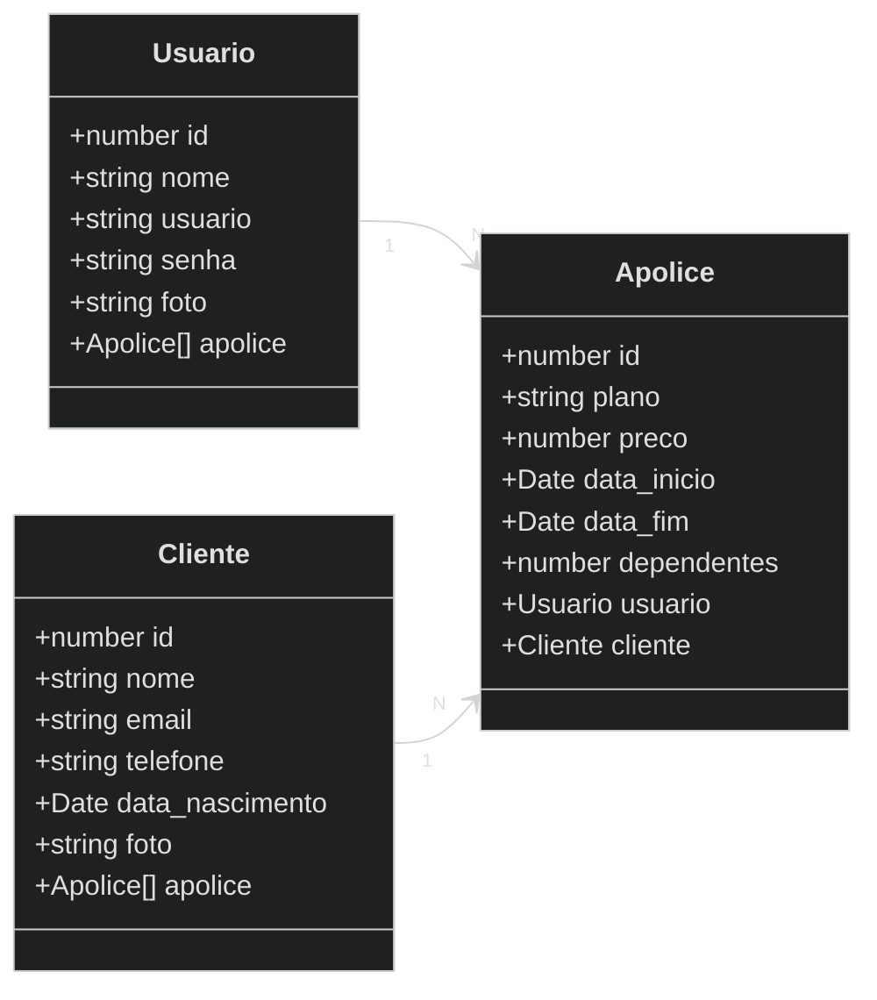
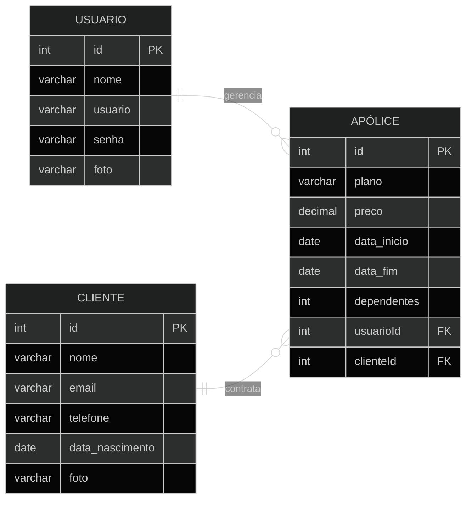

# VivaCare - Gerenciador de Seguros de Vida
------
<div align="center">
    
</div>

<div align="center">
  
  
  
  
</div>


## 1. Descrição

O **VivaCare** é uma solução digital desenvolvida para descomplicar a gestão de seguros de vida. O foco do projeto é substituir a burocracia e as "letras miúdas" por uma experiência fluida e intuitiva, permitindo que, os usuários (corretores) gerenciem os planos de cobertura com eficiência.

------

## 2. Sobre esta API

A API foi construída seguindo os princípios da arquitetura de MVC com **NestJS**, focando em tipagem forte com TypeScript e manutenibilidade. Ele funciona como um gerenciador de lista de clientes e apólices.

### 2.1. Principais Funcionalidades

📂 **Gerenciamento de Clientes:** Cadastro, listagem, atualização e exclusão de clientes.
📈 **Gerenciamento de Apólices:** Cadastro com planos, preços, datas de início/fim e dependentes.
🔗 **Relacionamento entre  Usuário/Cliente e Apólice:** Garante que quando pesquisamos por um usuário (corretor) ou por um cliente sejam retornadas na pesquisa também as apólices associadas. 
🔍 **Busca Avançada:** Além das opções padrão (pesquisar por id, pesquisar por nome, listar todos) também são permitidas buscas mais específicas como busca por e-mail cadastrado e busca por planos de em uma faixa de preço específica. 
🔑 **Autenticação:** Implementação de login e proteção de rotas, garantindo que apenas usuários autenticados acessem os recursos da API. 

------

## 3. Diagrama de Classes


------

## 4. Diagrama Entidade-Relacionamento (DER)
--------

-----

## 5. Estrutura de Pastas

Inserir aqui a estrutura

------

## 6. Tecnologias utilizadas

| Item                            | Descrição  |
| ------------------------------- | ---------- |
| 🖥️ **Servidor**                  | Node JS    |
| ⌨️ **Linguagem de programação**  | TypeScript |
| 🧩 **Framework**                 | Nest JS    |
| 🌉 **ORM**                       | TypeORM    |
| 🛢️ **Banco de dados Relacional** | MySQL      |

------

## 7. Configuração e Execução Local

**1. 📥 Clone o repositório:**

```bash
git clone https://github.com/Javascript13-Grupo02/Projeto-integrador-03-VivaCare.git
```
**2. 📦 Instale as dependências:**
```cmd
npm install
```
**3. 🛢️ Configure o Banco de Dados:**

Configure as credenciais do seu MySQL local (usuário, senha e nome do banco) no arquivo `dev.service.ts` na pasta `data` e modifique o arquivo `app.module.ts` de maneira que a seção de `imports` fique assim:

```typescript
imports: [
    ConfigModule.forRoot(),
    TypeOrmModule.forRootAsync({
	    useClass: DevService,
      imports: [ConfigModule],
    }),
    UsuarioModule, ApoliceModule, AuthModule, ClienteModule
  ]
```

**4. 🚀 Execute a Aplicação**

```cmd
npm run start:dev
```
------

<p align="center">
  Desenvolvido por <b>AllCare</b>.
</p>

<p align="center">
  
</p>
   